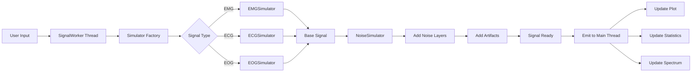
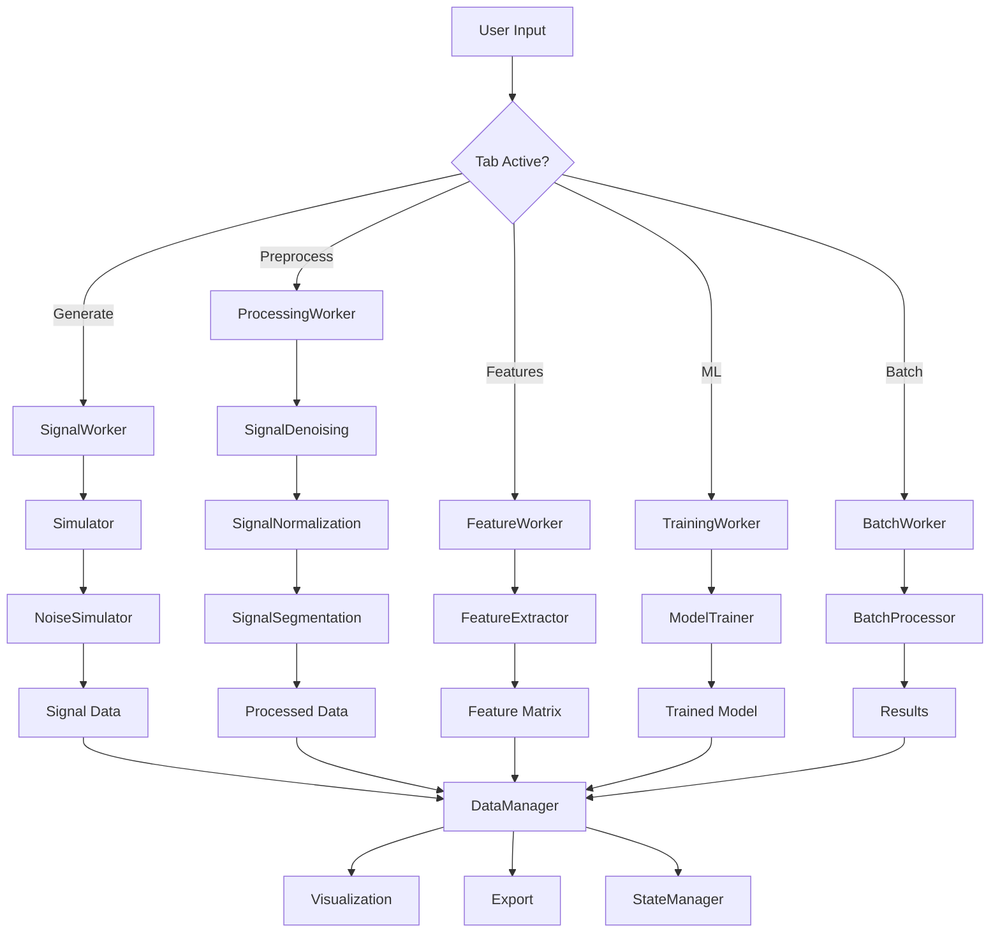
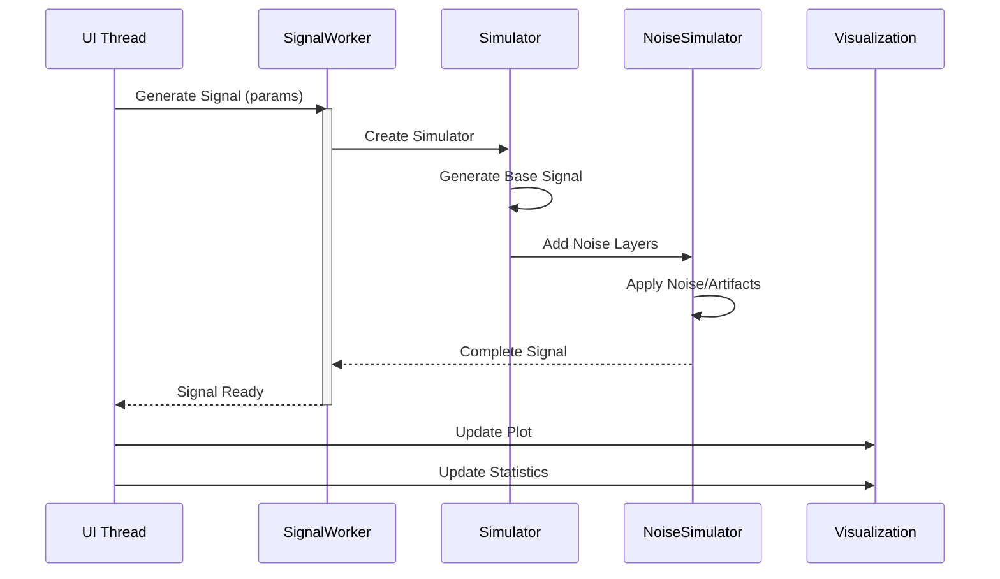
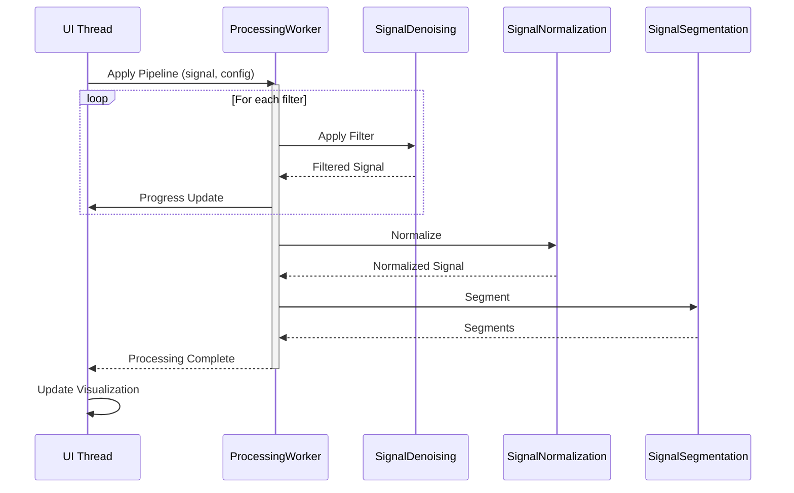
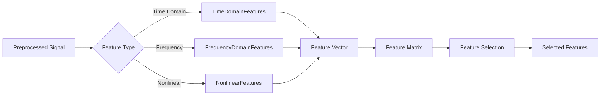
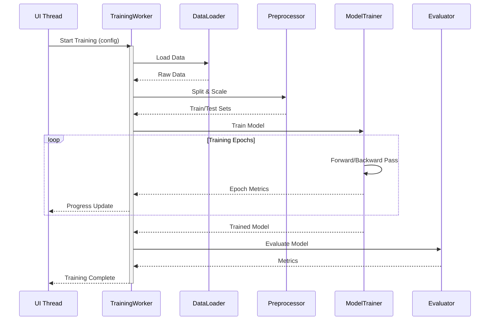

# Biosignal Framework - Complete UI Architecture Specification

## Executive Summary

This document specifies a state-of-the-art PyQt6-based biosignal processing application that exposes all framework capabilities through an intuitive, professional interface suitable for research and clinical use.

**Architecture Style**: Hybrid (Tab-based workflow + Dockable panels)
**Target Users**: Researchers, clinicians, signal processing engineers
**Core Principle**: Guided workflow with expert-level customization

**Design Decisions:**
1. **Navigation**: Hybrid tabs + dockable panels for flexibility
2. **Preprocessing**: Both sequential and parallel visualization modes
3. **ML Training**: Batch training only (cleaner, more reliable)
4. **Presets**: Hierarchical organization (Signal Type → Condition → Goal)
5. **Performance**: Adjustable quality/latency slider for real-time operations

---

## 1. Technology Stack

### Desktop Application
- **Framework**: PyQt6 (6.5+)
- **Visualization**:
  - PyQtGraph for real-time signal plotting (performance-critical)
  - Matplotlib for publication-quality static plots
  - Plotly for interactive 3D visualizations
- **Threading**: QThread for non-blocking operations
- **Event System**: Qt's signal-slot mechanism
- **Data Processing**: NumPy, SciPy, scikit-learn, PyTorch
- **File I/O**: h5py, MNE, WFDB, pyxdf

---

## 2. Overall Application Architecture

### 2.1 Main Window Layout

```
┌─────────────────────────────────────────────────────────────────────┐
│ MenuBar: File | Edit | View | Tools | Analysis | Help               │
├─────────────────────────────────────────────────────────────────────┤
│ ToolBar: [New] [Open] [Save] [Undo] [Redo] | [Run] [Stop] [Export] │
├───────────┬─────────────────────────────────────────────┬───────────┤
│           │                                             │           │
│  Preset   │        CENTRAL TAB WIDGET                   │ Property  │
│  Library  │  ┌───────────────────────────────────────┐  │  Panel    │
│  (Dock)   │  │ Tab: Generate | Preprocess | Features │  │  (Dock)   │
│           │  │      ML | Data | Analysis | Batch      │  │           │
│  • EMG    │  ├───────────────────────────────────────┤  │  Context- │
│    └─Iso  │  │                                       │  │  Sensitive│
│    └─Dyn  │  │     TAB CONTENT AREA                  │  │  Controls │
│  • ECG    │  │                                       │  │           │
│    └─NSR  │  │  (Each tab contains specialized       │  │  [Params] │
│    └─PVC  │  │   workspace with controls +           │  │  [Config] │
│  • EOG    │  │   visualization)                      │  │  [Preview]│
│           │  │                                       │  │           │
├───────────┤  └───────────────────────────────────────┘  ├───────────┤
│ Quick     │                                             │ Data      │
│ Actions   │  BOTTOM DOCK AREA                           │ Inspector │
│ (Dock)    │  • Processing Log                           │ (Dock)    │
│           │  • Error Console                            │           │
│ [▶ Run]   │  • Progress Tracker                         │ Signal:   │
│ [⏸ Pause] │                                             │  Type: EMG│
│ [⏹ Stop]  │                                             │  Fs: 1000 │
└───────────┴─────────────────────────────────────────────┴───────────┘
│ StatusBar: Ready | Mode: Generate | Progress: ████░░░░░ 60% | Fps: 30│
└─────────────────────────────────────────────────────────────────────┘
```

### 2.2 Navigation Structure - Hybrid Tab + Dock System

**Main Workflow Tabs** (Central Widget):
1. **Generate** - Signal Generation Studio
2. **Preprocess** - Preprocessing Pipeline
3. **Features** - Feature Engineering Workspace
4. **ML** - Machine Learning Workflow Manager
5. **Data** - Data Management Hub
6. **Analysis** - Advanced Visualization & Analysis
7. **Batch** - Batch Processing Engine

**Dockable Panels** (Can be arranged/hidden):
- Preset Library (Left)
- Property Panel (Right)
- Data Inspector (Right)
- Quick Actions (Left)
- Processing Log (Bottom)
- Error Console (Bottom)
- Progress Tracker (Bottom)

---

## 3. Tab 1: Signal Generation Studio

### 3.1 Purpose
Comprehensive signal synthesis with full control over EMG, ECG, EOG generation including noise and artifacts.

### 3.2 Layout

```
┌─────────────────────────────────────────────────────────────────────┐
│ SIGNAL GENERATION STUDIO                                            │
├───────────────────────┬─────────────────────────────────────────────┤
│ CONTROL PANEL         │ VISUALIZATION AREA                          │
│                       │                                             │
│ Signal Type:          │  ┌─────────────────────────────────────┐   │
│ ● EMG ○ ECG ○ EOG    │  │                                     │   │
│                       │  │    Real-time Signal Plot            │   │
│ ──── EMG Controls ────│  │    (PyQtGraph for performance)      │   │
│                       │  │                                     │   │
│ Pattern:              │  └─────────────────────────────────────┘   │
│ ○ Isometric           │                                             │
│ ○ Dynamic             │  ┌─────────────────────────────────────┐   │
│ ● Repetitive          │  │    Frequency Spectrum               │   │
│ ○ Complex             │  │    (Live FFT)                       │   │
│                       │  └─────────────────────────────────────┘   │
│ Intensity: [====] 0.7 │                                             │
│ Duration: 5.0 s       │  ┌─────────────────────────────────────┐   │
│ Fatigue: [==] 0.3     │  │    Statistics Panel                 │   │
│                       │  │    • RMS: 0.342 mV                  │   │
│ ──── Noise Layer ─────│  │    • Mean Freq: 85.3 Hz             │   │
│                       │  │    • SNR: 15.2 dB                   │   │
│ [+] Add Noise         │  └─────────────────────────────────────┘   │
│                       │                                             │
│ 1. Gaussian           │  Controls:                                  │
│    STD: [==] 0.1      │  [▶ Generate] [⏸ Pause] [⏹ Stop] [💾 Save]│
│    [×] Remove         │  [🔄 Refresh] [📋 Copy] [📤 Export]        │
│                       │                                             │
│ 2. Powerline (50Hz)   │  Performance:                               │
│    Amp: [=] 0.2       │  Quality: [========] High                   │
│    [×] Remove         │  Latency: 12ms | FPS: 60                   │
│                       │                                             │
│ [+] Add Artifact      │                                             │
│                       │                                             │
└───────────────────────┴─────────────────────────────────────────────┘
```

### 3.3 Component Hierarchy

```python
class SignalGenerationTab(QWidget):
    """Main signal generation workspace"""
    components:
        - SignalTypeSelector(QGroupBox)
            • EMG/ECG/EOG radio buttons
            • Signal-specific parameter container
        
        - EMGControlPanel(QGroupBox)
            • PatternSelector (isometric/dynamic/repetitive/complex)
            • IntensitySlider (0-1, 0.01 precision)
            • DurationSpinBox (0.1-60s)
            • FatigueSlider (0-1)
            • AdvancedButton → EMGAdvancedDialog
        
        - ECGControlPanel(QGroupBox)
            • HeartRateSpinBox (30-200 bpm)
            • ConditionComboBox (NSR, PVC, AF, STEMI, LBBB, etc.)
            • LeadSelector (I, II, III, aVR, aVL, aVF, V1-V6)
            • AbnormalityCheckboxes
        
        - EOGControlPanel(QGroupBox)
            • MovementTypeComboBox (saccade, smooth pursuit, fixation, blink)
            • AmplitudeSlider
            • FrequencySlider
            • DirectionSelector (horizontal/vertical/oblique)
        
        - NoiseArtifactManager(QWidget)
            • NoiseLayerList (QListWidget with custom items)
            • AddNoiseButton → NoiseConfigDialog
            • AddArtifactButton → ArtifactConfigDialog
            • Each layer has:
                - Type label
                - Parameter controls (sliders)
                - Enable/disable toggle
                - Remove button
        
        - VisualizationArea(QWidget)
            • SignalPlotWidget (PyQtGraph)
            • SpectrumPlotWidget (PyQtGraph)
            • StatisticsPanel (QGroupBox)
            • ControlButtonBar
            • PerformanceMonitor
```

### 3.4 Signal Type Specifications

#### EMG Parameters
```python
EMGParameters:
    # Pattern Type
    pattern: Literal['isometric', 'dynamic', 'repetitive', 'complex']
    
    # Isometric
    intensity: float = 0.7  # 0-1
    duration: float = 3.0   # seconds
    fatigue_rate: float = 0.0  # 0-1
    
    # Dynamic
    ramp_type: Literal['linear', 'exponential', 'step']
    max_intensity: float = 0.9
    ramp_duration: float = 2.0
    
    # Repetitive
    frequency: float = 0.5  # Hz (repetition rate)
    duty_cycle: float = 0.6  # 0-1
    burst_intensity: float = 0.7
    
    # Complex
    movements: list[str] = ['isometric', 'dynamic', 'rest']
    durations: list[float] = [1.0, 2.0, 1.0]
    intensities: list[float] = [0.8, 0.6, 0.0]
    overlap: bool = False
```

#### ECG Parameters
```python
ECGParameters:
    heart_rate: float = 75  # bpm (30-200)
    lead: str = 'II'  # Standard 12-lead options
    
    condition: Literal[
        'normal_sinus_rhythm',
        'premature_ventricular_contraction',
        'atrial_fibrillation',
        'ventricular_tachycardia',
        'stemi',  # ST-elevation MI
        'nstemi',  # Non-ST elevation MI
        'left_bundle_branch_block',
        'right_bundle_branch_block',
        'atrial_flutter'
    ]
    
    # Wave parameters (for normal rhythm)
    p_wave_amplitude: float = 0.15  # mV
    qrs_amplitude: float = 1.0
    t_wave_amplitude: float = 0.3
    pr_interval: float = 0.16  # seconds
    qrs_duration: float = 0.08
    qt_interval: float = 0.40
```

#### EOG Parameters
```python
EOGParameters:
    movement_type: Literal[
        'saccade',
        'smooth_pursuit', 
        'fixation',
        'blink',
        'combined'
    ]
    
    # Saccade
    amplitude: float = 100  # μV (20-500)
    direction: Literal['horizontal', 'vertical', 'oblique']
    frequency: float = 1.0  # saccades per second
    
    # Smooth Pursuit
    velocity: float = 30  # degrees/second
    target_frequency: float = 0.5  # Hz
    
    # Blink
    blink_rate: float = 0.25  # blinks per second
    blink_amplitude: float = 200  # μV
```

### 3.5 Noise & Artifact System

#### Noise Types (from NoiseSimulator)
```python
NoiseTypes = Literal[
    'gaussian',          # White noise
    'pink',              # 1/f noise
    'brown',             # 1/f² noise  
    'powerline',         # 50/60 Hz interference
    'baseline_wander',   # Low-frequency drift
    'high_frequency'     # HF noise
]

ArtifactTypes = Literal[
    # Motion
    'electrode_movement',
    'cable_motion',
    'subject_movement',
    'baseline_shift',
    
    # Electrode
    'poor_contact',
    'electrode_pop',
    'impedance_change',
    'dc_offset',
    
    # Interference
    'emg_crosstalk',
    'ecg_interference',
    'environmental',
    'device_artifact'
]
```

#### Noise Layer UI Component
```python
class NoiseLayerItem(QWidget):
    """Individual noise/artifact configuration"""
    
    layout:
        [Icon] Gaussian Noise    [Enable ☑]  [Remove ×]
               STD: [=======] 0.15
               Color: [🎨] #FF5733
```

### 3.6 Data Flow - Signal Generation



---

## 4. Tab 2: Preprocessing Pipeline

### 4.1 Purpose
Visual filter designer with sequential chain and parallel comparison modes, live preview, and before/after analysis.

### 4.2 Layout

```
┌─────────────────────────────────────────────────────────────────────┐
│ PREPROCESSING PIPELINE          View: ● Sequential ○ Parallel      │
├───────────────────────┬─────────────────────────────────────────────┤
│ PIPELINE BUILDER      │ VISUALIZATION                               │
│                       │                                             │
│ Input Signal:         │  ┌─────────────────────────────────────┐   │
│ EMG_data_001.h5       │  │  Sequential Mode:                   │   │
│ [📁 Load]             │  │                                     │   │
│                       │  │  [Original Signal Plot]             │   │
│ ─── Filter Chain ──── │  │           ↓                         │   │
│                       │  │  [After Filter 1 Plot]              │   │
│ 1. ☑ Bandpass Filter  │  │           ↓                         │   │
│    Low: 20 Hz         │  │  [After Filter 2 Plot]              │   │
│    High: 450 Hz       │  │           ↓                         │   │
│    Order: 4           │  │  [Final Output Plot]                │   │
│    [⚙️] [👁] [🗑]      │  │                                     │   │
│                       │  └─────────────────────────────────────┘   │
│ 2. ☑ Notch Filter     │                                             │
│    Freq: 50 Hz        │  ┌─────────────────────────────────────┐   │
│    Q: 30.0            │  │  Frequency Response                 │   │
│    [⚙️] [👁] [🗑]      │  │  (Magnitude & Phase)                │   │
│                       │  └─────────────────────────────────────┘   │
│ 3. ☐ Wavelet Denoise  │                                             │
│    Type: db4          │  ┌─────────────────────────────────────┐   │
│    Level: 3           │  │  Signal Quality Metrics             │   │
│    [⚙️] [👁] [🗑]      │  │  • Original SNR: 12.3 dB            │   │
│                       │  │  • Filtered SNR: 18.7 dB            │   │
│ [+ Add Filter]        │  │  • Improvement: +6.4 dB             │   │
│                       │  │  • RMS Noise: 0.034 mV              │   │
│ ─── Normalize ────    │  └─────────────────────────────────────┘   │
│                       │                                             │
│ Method:               │  [▶ Apply Pipeline] [💾 Save Pipeline]     │
│ ● Z-score             │  [📋 Copy Config] [📥 Load Pipeline]       │
│ ○ Min-Max             │  [🔄 Reset] [🔧 Optimize]                  │
│ ○ Robust              │                                             │
│                       │  Toggle View: [Sequential] [Parallel]      │
│ ─── Segment ──────    │                                             │
│                       │                                             │
│ Type:                 │                                             │
│ ○ Fixed Window        │                                             │
│ ● Overlap Window      │                                             │
│ ○ Event-Based         │                                             │
│                       │                                             │
│ Window: 1000 samples  │                                             │
│ Overlap: 50%          │                                             │
│                       │                                             │
└───────────────────────┴─────────────────────────────────────────────┘
```

### 4.3 Parallel Comparison Mode

```
┌─────────────────────────────────────────────────────────────────────┐
│ PARALLEL COMPARISON MODE                                            │
├─────────────────────────────────────────────────────────────────────┤
│                                                                     │
│  Original Signal        │  After Bandpass      │  After Notch       │
│  ┌───────────────────┐ │ ┌───────────────────┐│ ┌────────────────┐│
│  │                   │ │ │                   ││ │                ││
│  │   [Signal Plot]   │ │ │   [Signal Plot]   ││ │  [Signal Plot] ││
│  │                   │ │ │                   ││ │                ││
│  └───────────────────┘ │ └───────────────────┘│ └────────────────┘│
│  SNR: 12.3 dB          │ SNR: 15.8 dB         │ SNR: 18.7 dB       │
│                                                                     │
├─────────────────────────────────────────────────────────────────────┤
│                                                                     │
│  After Wavelet         │  After Normalize     │  Final Output       │
│  ┌───────────────────┐ │ ┌───────────────────┐│ ┌────────────────┐│
│  │                   │ │ │                   ││ │                ││
│  │   [Signal Plot]   │ │ │   [Signal Plot]   ││ │  [Signal Plot] ││
│  │                   │ │ │                   ││ │                ││
│  └───────────────────┘ │ └───────────────────┘│ └────────────────┘│
│  SNR: 20.1 dB          │ Mean: 0.0, Std: 1.0  │ Ready for features │
│                                                                     │
└─────────────────────────────────────────────────────────────────────┘
```

### 4.4 Component Hierarchy

```python
class PreprocessingTab(QWidget):
    """Preprocessing pipeline interface"""
    components:
        - InputSignalPanel(QGroupBox)
            • FilePathDisplay
            • LoadButton
            • SignalInfoLabel (type, fs, duration, channels)
        
        - FilterChainBuilder(QWidget)
            • FilterListWidget (drag-drop reorderable)
            • AddFilterButton → FilterSelectionDialog
            • Each FilterItem contains:
                - EnableCheckbox
                - FilterTypeLabel
                - ParameterControls (dynamic based on filter)
                - ConfigButton (detailed settings)
                - PreviewButton (show effect)
                - DeleteButton
        
        - NormalizationPanel(QGroupBox)
            • MethodRadioButtons (z-score/min-max/robust)
            • ParameterInputs (feature_range for min-max)
        
        - SegmentationPanel(QGroupBox)
            • TypeSelector (fixed/overlap/event-based)
            • WindowSizeSpinBox
            • OverlapSlider (for overlap mode)
            • EventFileSelector (for event-based)
        
        - VisualizationModeToggle(QWidget)
            • SequentialRadio
            • ParallelRadio
        
        - PreprocessingVisualization(QWidget)
            • SequentialView:
                - MultiPlotWidget (stacked plots)
                - NavigationControls (prev/next step)
            • ParallelView:
                - GridPlotWidget (2x3 grid)
                - SyncZoomPan (linked axes)
            • FrequencyResponsePlot
            • QualityMetricsPanel
        
        - ActionButtonBar(QWidget)
            • ApplyButton
            • SavePipelineButton
            • LoadPipelineButton
            • ResetButton
            • OptimizeButton (auto-tune parameters)
```

### 4.5 Filter Library

```python
FilterTypes:
    Denoising:
        - bandpass_filter: (lowcut, highcut, order)
        - notch_filter: (freq, q_factor)
        - wavelet_denoise: (wavelet, level, threshold_mode)
        - highpass_filter: (cutoff, order)
        - lowpass_filter: (cutoff, order)
    
    Normalization:
        - zscore_normalize: ()
        - minmax_scale: (feature_range)
        - robust_scale: ()
        - quantile_normalize: (n_quantiles)
    
    Segmentation:
        - fixed_window: (window_size)
        - overlap_window: (window_size, overlap)
        - event_based_segment: (events, pre_event, post_event)
```

### 4.6 Pipeline Configuration Format

```python
@dataclass
class PreprocessingPipeline:
    """Serializable pipeline configuration"""
    input_signal: Optional[str] = None  # File path
    filters: list[FilterConfig] = field(default_factory=list)
    normalization: Optional[NormalizationConfig] = None
    segmentation: Optional[SegmentationConfig] = None
    
    def to_dict(self) -> dict:
        """Export as JSON/YAML"""
        pass
    
    def from_dict(self, config: dict):
        """Import from JSON/YAML"""
        pass

@dataclass
class FilterConfig:
    type: str
    enabled: bool = True
    parameters: dict = field(default_factory=dict)
```

---

## 5. Tab 3: Feature Engineering Workspace

### 5.1 Purpose
Extract time, frequency, and nonlinear features from preprocessed signals with visualization and selection tools.

### 5.2 Layout

```
┌─────────────────────────────────────────────────────────────────────┐
│ FEATURE ENGINEERING WORKSPACE                                       │
├───────────────────┬─────────────────────────────────────────────────┤
│ FEATURE SELECTOR  │ VISUALIZATION & ANALYSIS                        │
│                   │                                                 │
│ Input Data:       │  ┌──────────────────────────────────────────┐  │
│ preprocessed.npz  │  │  Feature Values Visualization            │  │
│ [📁 Load]         │  │                                          │  │
│                   │  │  [Bar Chart / Box Plot / Violin Plot]    │  │
│ ── Time Domain ── │  │                                          │  │
│ ☑ RMS             │  └──────────────────────────────────────────┘  │
│ ☑ MAV             │                                                 │
│ ☑ ZCR             │  ┌──────────────────────────────────────────┐  │
│ ☑ Waveform Length │  │  Correlation Matrix Heatmap              │  │
│ ☐ SSC             │  │                                          │  │
│ ☐ VAR             │  │  [Interactive Heatmap with dendrogra │  │
│                   │  │                                          │  │
│ ── Frequency ───  │  └──────────────────────────────────────────┘  │
│ ☑ Mean Frequency  │                                                 │
│ ☑ Median Frequency│  ┌──────────────────────────────────────────┐  │
│ ☑ Band Power      │  │  Feature Importance (if target provided) │  │
│ ☐ Spectral Entropy│  │                                          │  │
│ ☐ Peak Frequency  │  │  [Bar chart showing feature importance]  │  │
│   Bands:          │  │                                          │  │
│   • Delta: 0-4 Hz │  └──────────────────────────────────────────┘  │
│   • Theta: 4-8 Hz │                                                 │
│   • Alpha: 8-13Hz │  Feature Statistics:                            │
│   • Beta: 13-30Hz │  ┌──────────────────────────────────────────┐  │
│   [⚙️ Configure]   │  │ Selected: 12 features                    │  │
│                   │  │ Total samples: 1,250                     │  │
│ ── Nonlinear ───  │  │ Feature matrix: 1,250 × 12               │  │
│ ☑ Sample Entropy  │  │ Missing values: 0                        │  │
│ ☑ Approx Entropy  │  │ Computation time: 1.23s                  │  │
│ ☑ Fractal Dim.    │  └──────────────────────────────────────────┘  │
│ ☐ DFA             │                                                 │
│ ☐ Hurst Exponent  │  [📊 Extract Features] [💾 Export CSV]         │
│                   │  [🔍 Feature Selection] [📈 Visualize]         │
│ [Select All]      │  [🧪 Statistical Tests] [📋 Generate Report]  │
│ [Deselect All]    │                                                 │
│ [Select Preset ▾] │  Feature Selection Method:                      │
│                   │  ○ Correlation threshold: [====] 0.8            │
│                   │  ○ Variance threshold: [===] 0.01               │
│                   │  ○ Mutual information                           │
│                   │  ○ PCA: Components [3]                          │
│                   │  ● Manual selection                             │
│                   │                                                 │
└───────────────────┴─────────────────────────────────────────────────┘
```

### 5.3 Component Hierarchy

```python
class FeatureEngineeringTab(QWidget):
    """Feature extraction workspace"""
    components:
        - InputDataPanel(QGroupBox)
            • FilePathDisplay
            • LoadButton
            • DataInfoLabel
        
        - FeatureSelectorTree(QGroupBox)
            • TimeDomainGroup:
                - Checkboxes for each feature
                - Parameter inputs where needed
            • FrequencyDomainGroup:
                - Feature checkboxes
                - BandConfigButton → BandConfigDialog
            • NonlinearGroup:
                - Feature checkboxes with parameter controls
            • PresetSelector (dropdown)
            • SelectAllButton
            • DeselectAllButton
        
        - FeatureVisualization(QWidget)
            • ValuePlotWidget (bar/box/violin)
            • CorrelationHeatmap (interactive)
            • ImportancePlot (when target available)
            • StatisticsPanel
        
        - FeatureSelectionPanel(QGroupBox)
            • MethodSelector (correlation/variance/MI/PCA/manual)
            • ThresholdControls (dynamic based on method)
            • ApplyButton
            • ResultsDisplay
        
        - ActionButtonBar(QWidget)
            • ExtractButton
            • ExportButton
            • VisualizeButton
            • StatisticalTestButton
            • ReportButton
```

### 5.4 Feature Extraction Specifications

```python
class FeatureExtractor:
    """Unified feature extraction interface"""
    
    time_domain_features: dict = {
        'rms': TimeDomainFeatures().rms,
        'mav': TimeDomainFeatures().mav,
        'zcr': TimeDomainFeatures().zero_crossing_rate,
        'ssc': TimeDomainFeatures().slope_sign_changes,
        'wl': TimeDomainFeatures().waveform_length,
        'var': lambda x: np.var(x),
        'std': lambda x: np.std(x),
        'skewness': lambda x: stats.skew(x),
        'kurtosis': lambda x: stats.kurtosis(x)
    }
    
    frequency_domain_features: dict = {
        'mean_freq': FrequencyDomainFeatures().mean_frequency,
        'median_freq': FrequencyDomainFeatures().median_frequency,
        'band_power': FrequencyDomainFeatures().frequency_band_power,
        'spectral_entropy': FrequencyDomainFeatures().spectral_entropy,
        'peak_freq': lambda x: # Peak frequency detection
    }
    
    nonlinear_features: dict = {
        'sample_entropy': NonlinearFeatures().sample_entropy,
        'approx_entropy': NonlinearFeatures().approximate_entropy,
        'fractal_dim': NonlinearFeatures().fractal_dimension,
        'dfa': # Detrended fluctuation analysis
        'hurst': # Hurst exponent
    }
    
    def extract(self, signal: np.ndarray, 
                selected_features: list[str]) -> pd.DataFrame:
        """Extract selected features from signal"""
        pass
```

---

## 6. Tab 4: ML Workflow Manager

### 6.1 Purpose
Complete machine learning workflow from data loading through model training, evaluation, and deployment.

### 6.2 Layout

```
┌─────────────────────────────────────────────────────────────────────┐
│ ML WORKFLOW MANAGER                    Stage: 3/5 - Training        │
├───────────────────┬─────────────────────────────────────────────────┤
│ WORKFLOW STEPS    │ STAGE CONTENT AREA                              │
│                   │                                                 │
│ 1. ✓ Data Loading │  ┌─────────────────────────────────────────┐   │
│ 2. ✓ Preparation  │  │ TRAINING CONFIGURATION                  │   │
│ 3. ⚙ Training     │  │                                         │   │
│ 4. ○ Evaluation   │  │ Model: Random Forest Classifier         │   │
│ 5. ○ Deployment   │  │                                         │   │
│                   │  │ Hyperparameters:                        │   │
│ ────────────────  │  │ • n_estimators: [100]                   │   │
│                   │  │ • max_depth: [10] (None for unlimited)  │   │
│ Quick Actions:    │  │ • min_samples_split: [2]                │   │
│ [⚡ AutoML]       │  │ • min_samples_leaf: [1]                 │   │
│ [📊 Compare]      │  │ • Random state: [42]                    │   │
│ [💾 Save Model]   │  │                                         │   │
│ [📤 Export]       │  │ Training Options:                       │   │
│                   │  │ ☑ Use cross-validation (5 folds)        │   │
│                   │  │ ☑ Class balancing                       │   │
│                   │  │ ☐ Grid search                           │   │
│                   │  │ ☐ Early stopping                        │   │
│                   │  │                                         │   │
│                   │  │ [🔧 Auto-tune] [▶ Start Training]       │   │
│                   │  └─────────────────────────────────────────┘   │
│                   │                                                 │
│                   │  ┌─────────────────────────────────────────┐   │
│                   │  │ TRAINING PROGRESS                       │   │
│                   │  │                                         │   │
│                   │  │ Epoch: 45/100                           │   │
│                   │  │ Progress: ████████░░ 45%                │   │
│                   │  │                                         │   │
│                   │  │ Train Loss: 0.234  Val Loss: 0.298      │   │
│                   │  │ Train Acc: 92.3%   Val Acc: 89.1%       │   │
│                   │  │                                         │   │
│                   │  │ Time Elapsed: 00:02:34                  │   │
│                   │  │ Time Remaining: ~00:03:05               │   │
│                   │  │                                         │   │
│                   │  │ [Live Training Curves]                  │   │
│                   │  │ Loss ─────── Accuracy ───────           │   │
│                   │  │  │\     /\                              │   │
│                   │  │  │ \   /  \                             │   │
│                   │  │  └──┴─┴────┴──                          │   │
│                   │  │                                         │   │
│                   │  │ [⏸ Pause] [⏹ Stop] [📊 Details]         │   │
│                   │  └─────────────────────────────────────────┘   │
│                   │                                                 │
└───────────────────┴─────────────────────────────────────────────────┘
```

### 6.3 Workflow Stages

#### Stage 1: Data Loading
```
┌─────────────────────────────────────────┐
│ DATA LOADING                            │
│                                         │
│ Data Source:                            │
│ ● From feature extraction               │
│ ○ Load from file                        │
│ ○ Load from database                    │
│                                         │
│ Feature File: features.csv              │
│ [📁 Browse]                             │
│                                         │
│ Target/Labels:                          │
│ Column: [class ▾]                       │
│ Classes detected: 3 (rest, grasp, pinch)│
│                                         │
│ Data Summary:                           │
│ • Samples: 1,500                        │
│ • Features: 18                          │
│ • Classes: 3 (balanced)                 │
│ • Missing values: 0                     │
│                                         │
│ [▶ Load Data] [🔍 Preview]              │
└─────────────────────────────────────────┘
```

#### Stage 2: Data Preparation
```
┌─────────────────────────────────────────┐
│ DATA PREPARATION                        │
│                                         │
│ Train/Test Split:                       │
│ Train: [====] 80%                       │
│ Test:  [==] 20%                         │
│ Stratify: ☑                             │
│ Random seed: [42]                       │
│                                         │
│ Feature Scaling:                        │
│ ● Standard Scaler                       │
│ ○ Min-Max Scaler                        │
│ ○ Robust Scaler                         │
│ ○ None                                  │
│                                         │
│ Feature Selection:                      │
│ Method: [Select Best ▾]                 │
│ k: [12] features                        │
│ [Apply]                                 │
│                                         │
│ Data Augmentation: (optional)           │
│ ☐ Add noise                             │
│ ☐ Time warping                          │
│ ☐ SMOTE oversampling                    │
│                                         │
│ [▶ Prepare Data]                        │
└─────────────────────────────────────────┘
```

#### Stage 3: Model Training
(See main layout above)

#### Stage 4: Evaluation
```
┌─────────────────────────────────────────────────────────────┐
│ MODEL EVALUATION                                            │
│                                                             │
│ ┌─────────────────────┐  ┌─────────────────────────────┐   │
│ │ Confusion Matrix    │  │ Classification Metrics      │   │
│ │                     │  │                             │   │
│ │     Pred           │  │ Accuracy:  92.3%            │   │
│ │    R  G  P          │  │ Precision: 91.8%            │   │
│ │ R  98  1  1  True   │  │ Recall:    92.1%            │   │
│ │ G   2 96  2         │  │ F1-Score:  91.9%            │   │
│ │ P   0  3 97         │  │                             │   │
│ │                     │  │ Per-Class Metrics:          │   │
│ │ [Normalize] [Export]│  │ Rest:   P=98% R=99% F1=98%  │   │
│ └─────────────────────┘  │ Grasp:  P=92% R=88% F1=90%  │   │
│                          │ Pinch:  P=91% R=94% F1=93%  │   │
│ ┌─────────────────────┐  └─────────────────────────────┘   │
│ │ ROC Curves          │                                     │
│ │                     │  ┌─────────────────────────────┐   │
│ │ [Multi-class ROC]   │  │ Cross-Validation Results    │   │
│ │                     │  │                             │   │
│ │  1.0 ┌──────       │  │ 5-Fold CV:                  │   │
│ │      │            │  │ Mean Accuracy: 91.2%        │   │
│ │  0.5 │            │  │ Std Dev: ±2.1%              │   │
│ │      │            │  │                             │   │
│ │  0.0 └────────     │  │ Fold Results:               │   │
│ │    0.0  0.5  1.0   │  │ 1: 92.3%  2: 89.8%          │   │
│ │                     │  │ 3: 91.5%  4: 90.1%          │   │
│ │ [Export Curves]     │  │ 5: 92.4%                    │   │
│ └─────────────────────┘  └─────────────────────────────┘   │
│                                                             │
│ [📊 Detailed Report] [💾 Save Results] [🔄 Retrain]        │
└─────────────────────────────────────────────────────────────┘
```

#### Stage 5: Deployment
```
┌─────────────────────────────────────────┐
│ MODEL DEPLOYMENT                        │
│                                         │
│ Model Information:                      │
│ • Type: Random Forest                   │
│ • Features: 18                          │
│ • Classes: 3                            │
│ • Accuracy: 92.3%                       │
│ • Size: 2.4 MB                          │
│                                         │
│ Save Model:                             │
│ Format: ● Pickle ○ ONNX ○ TorchScript  │
│ Path: models/rf_classifier.pkl          │
│ [📁 Browse] [💾 Save]                   │
│                                         │
│ Export Configuration:                   │
│ ☑ Include preprocessing pipeline        │
│ ☑ Include feature scaler                │
│ ☑ Include metadata                      │
│ ☐ Generate inference code               │
│                                         │
│ Model Card:                             │
│ [📝 Generate Documentation]             │
│                                         │
│ Inference Test:                         │
│ [🧪 Test with Sample Data]              │
│                                         │
│ [✅ Deploy Model] [📤 Export Package]    │
└─────────────────────────────────────────┘
```

### 6.4 Component Hierarchy

```python
class MLWorkflowTab(QWidget):
    """ML workflow manager"""
    components:
        - WorkflowNavigator(QListWidget)
            • Stage items with status icons
            • Click to jump to stage
        
        - QuickActionsPanel(QGroupBox)
            • AutoMLButton
            • CompareModelsButton
            • SaveModelButton
            • ExportButton
        
        - StageContentStack(QStackedWidget)
            • DataLoadingStage(QWidget)
            • PreparationStage(QWidget)
            • TrainingStage(QWidget)
            • EvaluationStage(QWidget)
            • DeploymentStage(QWidget)
        
        # Training Stage Components
        - ModelSelector(QComboBox)
            • SVM, RandomForest, GradientBoosting
            • CNN, LSTM, Ensemble
        
        - HyperparameterPanel(QWidget)
            • Dynamic form based on selected model
            • Auto-tune button
        
        - TrainingOptions(QGroupBox)
            • CrossValidationCheckbox
            • ClassBalancingCheckbox
            • GridSearchCheckbox
            • EarlyStoppingCheckbox
        
        - TrainingMonitor(QWidget)
            • ProgressBar
            • MetricsDisplay (loss, accuracy)
            • LiveCurvesPlot (matplotlib)
            • TimeEstimator
            • ControlButtons (pause/stop)
        
        # Evaluation Stage Components
        - EvaluationDashboard(QWidget)
            • ConfusionMatrixPlot
            • MetricsPanel
            • ROCCurvesPlot
            • CrossValidationResults
            • DetailedReportButton
```

### 6.5 Model Library

```python
ModelTypes:
    Classical:
        - SVM: (kernel, C, gamma)
        - RandomForest: (n_estimators, max_depth, min_samples_split)
        - GradientBoosting: (n_estimators, learning_rate, max_depth)
        - KNN: (n_neighbors, weights, metric)
        - NaiveBayes: (variant)
    
    Deep Learning:
        - CNN: (architecture, layers, filters, kernel_size, epochs, batch_size)
        - LSTM: (units, layers, dropout, epochs, batch_size)
        - Transformer: (heads, layers, d_model, epochs)
        - Autoencoder: (encoding_dim, layers, activation)
    
    Ensemble:
        - VotingClassifier: (models, weights, voting_type)
        - StackingClassifier: (base_models, meta_model)
        - BaggingClassifier: (base_estimator, n_estimators)
```

---

## 7. Tab 5: Data Management Hub

### 7.1 Purpose
File browser, multi-format loader, metadata inspector, and dataset organization.

### 7.2 Layout

```
┌─────────────────────────────────────────────────────────────────────┐
│ DATA MANAGEMENT HUB                                                 │
├───────────────────┬─────────────────────────────────────────────────┤
│ FILE BROWSER      │ DATA VIEWER & INSPECTOR                         │
│                   │                                                 │
│ 📁 c:/biosignals/ │  File: EMG_subject_001.h5                       │
│  ├─📁 EMG         │  Format: HDF5                                   │
│  │ ├─ 📄 sub1.h5  │  Size: 12.4 MB                                  │
│  │ ├─ 📄 sub2.h5  │  Modified: 2025-01-15 14:23                     │
│  │ └─ 📄 sub3.edf │                                                 │
│  ├─📁 ECG         │  ┌────────────────────────────────────────┐    │
│  │ ├─ 📄 ecg1.wfdb│  │ SIGNAL PREVIEW                         │    │
│  │ └─ 📄 ecg2.edf │  │                                        │    │
│  └─📁 EOG         │  │ Channels: 8                            │    │
│    └─ 📄 eog.fif  │  │ ┌──────────────────────────────────┐  │    │
│                   │  │ │ Ch1: [Signal waveform]           │  │    │
│ [🔍 Search]       │  │ │ Ch2: [Signal waveform]           │  │    │
│ [📁 Add Folder]   │  │ │ Ch3: [Signal waveform]           │  │    │
│ [↻ Refresh]       │  │ │ ...                              │  │    │
│                   │  │ └──────────────────────────────────┘  │    │
│ Filters:          │  └────────────────────────────────────────┘    │
│ Type: [All ▾]     │                                                 │
│ Date: [Any ▾]     │  ┌────────────────────────────────────────┐    │
│                   │  │ METADATA                               │    │
│ Sort by:          │  │                                        │    │
│ ● Name            │  │ Sampling Rate: 1000 Hz                 │    │
│ ○ Date            │  │ Duration: 30.5 seconds                 │    │
│ ○ Size            │  │ Channels: 8                            │    │
│ ○ Type            │  │ Signal Type: EMG                       │    │
│                   │  │ Subject ID: S001                       │    │
│ Recent Files:     │  │ Session: 2025-01-15                    │    │
│ • sub1.h5         │  │ Condition: Healthy                     │    │
│ • ecg2.edf        │  │ Notes: Biceps brachii recording        │    │
│ • eog.fif         │  │                                        │    │
│                   │  │ Custom Fields:                         │    │
│                   │  │ • Electrode: Delsys Trigno             │    │
│                   │  │ • Placement: Left arm                  │    │
│                   │  │ • Task: Isometric contraction          │    │
│                   │  │                                        │    │
│                   │  │ [✏️ Edit Metadata] [📋 Copy Info]      │    │
│                   │  └────────────────────────────────────────┘    │
│                   │                                                 │
│                   │  Actions:                                       │
│                   │  [📤 Load into Workspace] [🔄 Convert Format]   │
│                   │  [📊 Quick Stats] [🗑️ Delete]                  │
│                   │                                                 │
│                   │  Batch Operations:                              │
│                   │  [Select Multiple] [📦 Export Batch]            │
│                   │  [🏷️ Tag Files] [📁 Organize]                  │
│                   │                                                 │
└───────────────────┴─────────────────────────────────────────────────┘
```

### 7.3 Supported File Formats

```python
SupportedFormats:
    Biosignal:
        - HDF5 (.h5, .hdf5): Generic hierarchical format
        - EDF (.edf): European Data Format
        - BDF (.bdf): BioSemi Data Format
        - WFDB (.wfdb, .dat, .hea): PhysioNet/WFDB format
        - FIF (.fif): Elekta Neuromag format
        - XDF (.xdf): Extensible Data Format (LSL)
        - GDF (.gdf): General Data Format
        - MAT (.mat): MATLAB format
    
    Generic:
        - NumPy (.npy, .npz): NumPy arrays
        - CSV (.csv): Comma-separated values
        - JSON (.json): JavaScript Object Notation
        - Pickle (.pkl): Python pickle
    
    Export:
        - All above formats
        - Excel (.xlsx)
        - Parquet (.parquet)
```

### 7.4 Component Hierarchy

```python
class DataManagementTab(QWidget):
    """Data management interface"""
    components:
        - FileBrowserPanel(QGroupBox)
            • DirectoryTreeView (QTreeView)
            • SearchBar
            • AddFolderButton
            • RefreshButton
            • FilterControls
            • SortingOptions
            • RecentFilesList
        
        - DataViewerPanel(QGroupBox)
            • FileInfoDisplay
            • SignalPreviewWidget (multi-channel)
            • MetadataEditor
            • ActionButtonBar
        
        - BatchOperationsPanel(QGroupBox)
            • SelectionControls
            • BatchExportButton
            • TaggingSystem
            • OrganizeButton
```

---

## 8. Tab 6: Advanced Visualization & Analysis

### 8.1 Purpose
Multi-signal comparison, spectrograms, time-frequency analysis, 3D feature space visualization.

### 8.2 Layout

```
┌─────────────────────────────────────────────────────────────────────┐
│ ADVANCED VISUALIZATION & ANALYSIS                                   │
├───────────────────┬─────────────────────────────────────────────────┤
│ VISUALIZATION     │ DISPLAY AREA                                    │
│ CONTROLS          │                                                 │
│                   │  Mode: ● Multi-Signal ○ Spectrogram ○ 3D       │
│ Signals:          │                                                 │
│ ☑ Signal 1 (EMG)  │  ┌─────────────────────────────────────────┐   │
│   Color: [🎨] Red │  │ MULTI-SIGNAL COMPARISON                 │   │
│   Style: [Solid▾] │  │                                         │   │
│                   │  │ Signal 1 (EMG) ─────────────────────    │   │
│ ☑ Signal 2 (ECG)  │  │  │\  /\  /\  /\                        │   │
│   Color: [🎨] Blue│  │  └─┴──┴──┴──┴─                         │   │
│   Style: [Solid▾] │  │                                         │   │
│                   │  │ Signal 2 (ECG) ─────────────────────    │   │
│ ☐ Signal 3 (EOG)  │  │  │ ╱│ ╱│ ╱│                             │   │
│   Color: [🎨]Green│  │  └┴──┴──┴──                            │   │
│   Style: [Dash▾]  │  │                                         │   │
│                   │  │ [Synchronized time axis]                │   │
│ [+ Add Signal]    │  │                                         │   │
│ [🗑️ Remove]       │  │ Sync Zoom/Pan: ☑                        │   │
│                   │  │ Show Grid: ☑                            │   │
│ Layout:           │  └─────────────────────────────────────────┘   │
│ ● Stacked         │                                                 │
│ ○ Overlayed       │  Analysis Tools:                                │
│ ○ Grid (2x2)      │  ┌─────────────────────────────────────────┐   │
│                   │  │ Cursor Measurements:                    │   │
│ Axes:             │  │ Time: 2.543 s                           │   │
│ X: [0.0 - 10.0] s │  │ Signal 1: 0.234 mV                      │   │
│ Y: [Auto]         │  │ Signal 2: 1.023 mV                      │   │
│ [Reset View]      │  │                                         │   │
│                   │  │ Peak Detection:                         │   │
│ Markers:          │  │ Signal 1: 15 peaks found                │   │
│ ☑ Show peaks      │  │ Avg interval: 0.67s (89 bpm)            │   │
│ ☐ Show events     │  └─────────────────────────────────────────┘   │
│ ☐ Annotations     │                                                 │
│                   │  [💾 Export Plot] [📋 Copy Image]              │
│ Export:           │  [📊 Statistics] [🔍 Measure Tool]             │
│ Format: [PNG▾]    │                                                 │
│ DPI: [300]        │                                                 │
│                   │                                                 │
└───────────────────┴─────────────────────────────────────────────────┘
```

### 8.3 Visualization Modes

#### Mode 1: Multi-Signal Comparison
- Side-by-side or overlayed plots
- Synchronized zoom/pan
- Interactive cursors with measurements
- Peak/event detection and annotation

#### Mode 2: Spectrogram & Time-Frequency
```
┌─────────────────────────────────────────┐
│ TIME-FREQUENCY ANALYSIS                 │
│                                         │
│ Method: ● STFT ○ Wavelet ○ Hilbert     │
│                                         │
│ STFT Parameters:                        │
│ Window: [Hann ▾]                        │
│ Window Size: [256]                      │
│ Overlap: [====] 50%                     │
│ NFFT: [512]                             │
│                                         │
│ Colormap: [Viridis ▾]                   │
│ Scale: ○ Linear ● Logarithmic           │
│                                         │
│ [▶ Compute Spectrogram]                 │
│                                         │
│ ┌─────────────────────────────────┐     │
│ │ Frequency (Hz)                  │     │
│ │ 500 │█████░░░░░░░░░████          │     │
│ │ 400 │████████░░░░████            │     │
│ │ 300 │████████████████            │     │
│ │ 200 │██████████████████          │     │
│ │ 100 │████████████████████        │     │
│ │   0 └──────────────────────      │     │
│ │     0    2    4    6    8  Time │     │
│ └─────────────────────────────────┘     │
│                                         │
│ [📊 Power Distribution] [📈 Ridge Extract│
└─────────────────────────────────────────┘
```

#### Mode 3: 3D Feature Space
```
┌─────────────────────────────────────────┐
│ 3D FEATURE SPACE VISUALIZATION          │
│                                         │
│ Axes:                                   │
│ X: [RMS ▾]                              │
│ Y: [Mean Frequency ▾]                   │
│ Z: [Sample Entropy ▾]                   │
│                                         │
│ Color by: [Class ▾]                     │
│ Point size: [Medium ▾]                  │
│                                         │
│ ┌─────────────────────────────────┐     │
│ │      3D Interactive Plot         │     │
│ │   (Plotly/PyQtGraph GL)          │     │
│ │                                  │     │
│ │    Z│   ∘ Class A                │     │
│ │     │  ● Class B                 │     │
│ │     │  ▲ Class C                 │     │
│ │     │                            │     │
│ │     └────── Y                    │     │
│ │    ╱                             │     │
│ │   ╱ X                            │     │
│ │                                  │     │
│ │ [Rotate | Pan | Zoom]            │     │
│ └─────────────────────────────────┘     │
│                                         │
│ Visualization:                          │
│ ☑ Show centroids                        │
│ ☑ Decision boundaries                   │
│ ☐ Convex hulls                          │
│                                         │
│ [🎬 Animate] [📸 Snapshot] [💾 Export]  │
└─────────────────────────────────────────┘
```

### 8.4 Component Hierarchy

```python
class AnalysisTab(QWidget):
    """Advanced visualization and analysis"""
    components:
        - SignalManagementPanel(QGroupBox)
            • SignalList (checkboxes, colors, styles)
            • AddSignalButton
            • RemoveButton
            • LayoutSelector (stacked/overlay/grid)
        
        - VisualizationModeSelector(QWidget)
            • MultiSignalRadio
            • SpectrogramRadio
            • 3DFeatureSpaceRadio
        
        - DisplayArea(QStackedWidget)
            • MultiSignalView(QWidget)
                - SynchronizedPlots (PyQtGraph)
                - CursorTools
                - MeasurementPanel
            
            • SpectrogramView(QWidget)
                - TimeFrequencyPlot (Matplotlib)
                - ParameterControls
                - AnalysisTools
            
            • FeatureSpace3DView(QWidget)
                - 3DPlot (PyQtGraph.opengl or Plotly)
                - AxisSelectors
                - VisualizationOptions
        
        - AnalysisToolsPanel(QGroupBox)
            • MeasurementTools
            • PeakDetection
            • StatisticsCalculator
            • ExportControls
```

---

## 9. Tab 7: Batch Processing Engine

### 9.1 Purpose
Pipeline templates, parameter sweeps, queue management, automated workflows.

### 9.2 Layout

```
┌─────────────────────────────────────────────────────────────────────┐
│ BATCH PROCESSING ENGINE                                             │
├───────────────────┬─────────────────────────────────────────────────┤
│ PIPELINE TEMPLATE │ BATCH CONFIGURATION                             │
│                   │                                                 │
│ Template:         │  Pipeline: Custom EMG Analysis                  │
│ [Select ▾]        │                                                 │
│ • EMG Pipeline    │  ┌─────────────────────────────────────────┐   │
│ • ECG Pipeline    │  │ PROCESSING STEPS                        │   │
│ • Feature Extract │  │                                         │   │
│ • Custom...       │  │ 1. Load Signal                          │   │
│                   │  │ 2. Bandpass Filter (20-450 Hz)          │   │
│ [📝 New]          │  │ 3. Notch Filter (50 Hz)                 │   │
│ [✏️ Edit]          │  │ 4. Z-score Normalization                │   │
│ [💾 Save]         │  │ 5. Segment (1000 samples, 50% overlap)  │   │
│ [🗑️ Delete]       │  │ 6. Extract Features (12 features)       │   │
│                   │  │ 7. Export Results                       │   │
│ ────────────────  │  │                                         │   │
│                   │  │ [↑] [↓] [+] [×]                         │   │
│ Input Files:      │  └─────────────────────────────────────────┘   │
│                   │                                                 │
│ Source: [Folder▾] │  ┌─────────────────────────────────────────┐   │
│ Path:             │  │ INPUT SELECTION                         │   │
│ c:/data/emg/      │  │                                         │   │
│ [📁 Browse]       │  │ Source: Folder                          │   │
│                   │  │ Files found: 45                         │   │
│ Pattern:          │  │                                         │   │
│ *.h5, *.edf       │  │ ☑ Include subfolders                    │   │
│                   │  │ ☐ Filter by date                        │   │
│ Found: 45 files   │  │ ☐ Filter by size                        │   │
│ [🔍 Preview]      │  │                                         │   │
│                   │  │ Files to process:                       │   │
│ ────────────────  │  │ • subject_001.h5                        │   │
│                   │  │ • subject_002.h5                        │   │
│ Output:           │  │ • subject_003.h5                        │   │
│                   │  │ ... (42 more)                           │   │
│ Folder:           │  │                                         │   │
│ c:/data/results/  │  │ [Select All] [Deselect All]             │   │
│ [📁 Browse]       │  └─────────────────────────────────────────┘   │
│                   │                                                 │
│ Format: [HDF5▾]   │  Parameter Sweep: (optional)                    │
│                   │  ☐ Enable parameter sweep                       │
│ ☑ Preserve folder │  Parameter: [Filter Cutoff ▾]                  │
│   structure       │  Range: [10] to [100] Hz                        │
│ ☑ Generate report │  Steps: [10]                                    │
│                   │                                                 │
│ ────────────────  │  [▶ Start Batch] [⏸ Pause] [⏹ Stop]            │
│                   │  [📋 Queue Manager] [📊 View Results]           │
│ [▶ Run Batch]     │                                                 │
│                   │                                                 │
└───────────────────┴─────────────────────────────────────────────────┘

┌─────────────────────────────────────────────────────────────────────┐
│ PROCESSING QUEUE & PROGRESS                                         │
├─────────────────────────────────────────────────────────────────────┤
│                                                                     │
│ Overall Progress: ████████░░░░░░░░ 18/45 (40%)                     │
│ Time Elapsed: 00:05:32  |  Estimated Remaining: 00:07:45           │
│                                                                     │
│ ┌─────────────────────────────────────────────────────────────┐     │
│ │ File               Status      Progress  Time    Result     │     │
│ ├─────────────────────────────────────────────────────────────┤     │
│ │ subject_001.h5    ✓ Complete   100%      0:18   Success    │     │
│ │ subject_002.h5    ✓ Complete   100%      0:17   Success    │     │
│ │ subject_003.h5    ⚠ Warning    100%      0:19   Low SNR    │     │
│ │ ...                                                          │     │
│ │ subject_018.h5    ⚙ Processing  45%      -      -          │     │
│ │ subject_019.h5    ○ Pending     0%       -      -          │     │
│ │ ...                                                          │     │
│ │ subject_045.h5    ○ Pending     0%       -      -          │     │
│ └─────────────────────────────────────────────────────────────┘     │
│                                                                     │
│ Statistics:                                                         │
│ • Completed: 17     • Success: 16     • Warnings: 1                │
│ • Processing: 1     • Failed: 0       • Pending: 27                │
│                                                                     │
│ [📊 View Logs] [💾 Export Results] [📧 Send Report]                │
│                                                                     │
└─────────────────────────────────────────────────────────────────────┘
```

### 9.3 Component Hierarchy

```python
class BatchProcessingTab(QWidget):
    """Batch processing engine"""
    components:
        - PipelineTemplatePanel(QGroupBox)
            • TemplateSelector
            • NewButton
            • EditButton
            • SaveButton
            • DeleteButton
        
        - PipelineBuilder(QWidget)
            • StepList (reorderable)
            • AddStepButton
            • RemoveStepButton
            • MoveUpDownButtons
        
        - InputConfigPanel(QGroupBox)
            • SourceTypeSelector (folder/list/database)
            • PathBrowser
            • PatternInput
            • FileCountDisplay
            • PreviewButton
        
        - OutputConfigPanel(QGroupBox)
            • OutputFolderBrowser
            • FormatSelector
            • OptionsCheckboxes
        
        - ParameterSweepPanel(QGroupBox)
            • EnableCheckbox
            • ParameterSelector
            • RangeInputs
            • StepsInput
        
        - ProcessingQueueView(QTableWidget)
            • File list with status
            • Progress bars
            • Result indicators
        
        - ProgressMonitor(QWidget)
            • OverallProgressBar
            • TimeEstimator
            • StatisticsDisplay
        
        - ActionButtons(QWidget)
            • StartButton
            • PauseButton
            • StopButton
            • QueueManagerButton
            • ViewResultsButton
```

### 9.4 Pipeline Template Format

```python
@dataclass
class ProcessingPipelineTemplate:
    """Batch processing pipeline template"""
    name: str
    description: str
    steps: list[ProcessingStep]
    input_config: InputConfig
    output_config: OutputConfig
    parameter_sweep: Optional[ParameterSweep] = None
    
@dataclass
class ProcessingStep:
    type: Literal['load', 'filter', 'normalize', 'segment', 
                  'extract_features', 'train_model', 'export']
    parameters: dict
    enabled: bool = True

@dataclass
class ParameterSweep:
    parameter_name: str
    start_value: float
    end_value: float
    num_steps: int
    scale: Literal['linear', 'log'] = 'linear'
```

---

## 10. Export & Reporting System

### 10.1 Multi-Format Export

```python
ExportFormats:
    Data:
        - CSV: Tabular data export
        - JSON: Structured data
        - NumPy: .npy/.npz arrays
        - HDF5: Large datasets
        - Excel: .xlsx with multiple sheets
        - MATLAB: .mat format
        - Parquet: Columnar format
    
    Figures:
        - PNG: (dpi configurable)
        - SVG: Vector graphics
        - PDF: Publication quality
        - EPS: PostScript
        - HTML: Interactive plots (Plotly)
    
    Reports:
        - PDF Report: Complete analysis report
        - HTML Report: Interactive web report
        - Markdown: Text-based report
        - LaTeX: Academic format
```

### 10.2 Report Generation

```python
class ReportGenerator:
    """Automated report generation"""
    
    sections:
        - Summary: Overview of analysis
        - Methods: Processing steps and parameters
        - Results: Figures and tables
        - Statistics: Quantitative results
        - Conclusions: Key findings
        - Appendix: Detailed data
    
    def generate(self, template: str, data: dict) -> str:
        """Generate report from template"""
        pass
```

---

## 11. Widget Hierarchy & Organization

### 11.1 Main Application Structure

```python
class BiosignalFrameworkApp(QApplication):
    """Main application class"""
    pass

class MainWindow(QMainWindow):
    """Main application window"""
    
    # Core Components
    central_widget: QTabWidget  # Main tab container
    preset_dock: QDockWidget  # Preset library
    property_dock: QDockWidget  # Property panel
    data_dock: QDockWidget  # Data inspector
    actions_dock: QDockWidget  # Quick actions
    log_dock: QDockWidget  # Processing log
    console_dock: QDockWidget  # Error console
    progress_dock: QDockWidget  # Progress tracker
    
    # Managers
    state_manager: StateManager
    error_handler: ErrorHandler
    feedback_manager: FeedbackManager
    data_manager: DataManager
    
    # Workers
    signal_worker: SignalWorker
    processing_worker: ProcessingWorker
    feature_worker: FeatureWorker
    training_worker: TrainingWorker
    batch_worker: BatchWorker
```

### 11.2 Preset Library Organization

```
Preset Library (Hierarchical Tree)
├─ 📁 EMG
│  ├─ 📁 Muscle Contraction
│  │  ├─ 📄 Isometric - Light
│  │  ├─ 📄 Isometric - Moderate
│  │  ├─ 📄 Isometric - Heavy
│  │  ├─ 📄 Dynamic - Ramp Up
│  │  ├─ 📄 Dynamic - Ramp Down
│  │  ├─ 📄 Repetitive - Slow
│  │  └─ 📄 Repetitive - Fast
│  ├─ 📁 Fatigue Studies
│  │  ├─ 📄 Progressive Fatigue
│  │  └─ 📄 Recovery Pattern
│  └─ 📁 Clinical Conditions
│     ├─ 📄 Myopathy
│     └─ 📄 Neuropathy
├─ 📁 ECG
│  ├─ 📁 Normal Rhythms
│  │  ├─ 📄 Sinus Rhythm (60 bpm)
│  │  ├─ 📄 Sinus Rhythm (75 bpm)
│  │  └─ 📄 Sinus Rhythm (100 bpm)
│  ├─ 📁 Arrhythmias
│  │  ├─ 📄 Atrial Fibrillation
│  │  ├─ 📄 PVCs (Occasional)
│  │  ├─ 📄 PVCs (Frequent)
│  │  └─ 📄 Ventricular Tachycardia
│  └─ 📁 Ischemic Events
│     ├─ 📄 STEMI - Anterior
│     ├─ 📄 STEMI - Inferior
│     └─ 📄 NSTEMI
└─ 📁 EOG
   ├─ 📁 Eye Movements
   │  ├─ 📄 Saccades - Horizontal
   │  ├─ 📄 Saccades - Vertical
   │  ├─ 📄 Smooth Pursuit
   │  └─ 📄 Fixation
   └─ 📁 Blink Patterns
      ├─ 📄 Normal Blink Rate
      └─ 📄 Rapid Blinking
```

---

## 12. Data Flow Architecture

### 12.1 Overall Data Flow



### 12.2 Signal Generation Flow



### 12.3 Preprocessing Flow



### 12.4 Feature Extraction Flow



### 12.5 ML Training Flow



---

## 13. Threading Model & Performance

### 13.1 Thread Architecture

```python
MainThread:
    - UI updates
    - Event handling
    - User interactions
    - Plot rendering (PyQtGraph - efficient)

SignalWorker (QThread):
    - Signal generation
    - Noise/artifact addition
    - Real-time simulation
    Priority: High (for responsive preview)

ProcessingWorker (QThread):
    - Filtering operations
    - Normalization
    - Segmentation
    Priority: High

FeatureWorker (QThread):
    - Feature extraction
    - Statistical calculations
    - Matrix operations
    Priority: Medium

TrainingWorker (QThread):
    - Model training
    - Cross-validation
    - Hyperparameter tuning
    Priority: Low (long-running)

BatchWorker (QThread):
    - Batch processing
    - Multiple file operations
    - Pipeline execution
    Priority: Low
    Uses: ThreadPoolExecutor for parallel file processing
```

### 13.2 Performance Optimizations

```python
Optimizations:
    Signal Visualization:
        - PyQtGraph for real-time plotting (OpenGL acceleration)
        - Data decimation for large signals (>100K points)
        - Viewbox clipping (only render visible data)
        - Update rate limiting (max 60 fps)
    
    Data Processing:
        - NumPy vectorization (avoid Python loops)
        - In-place operations where possible
        - Chunked processing for large datasets
        - Numba JIT compilation for bottlenecks
    
    UI Responsiveness:
        - Threaded operations for all heavy tasks
        - Progress callbacks every 100ms
        - Cancelable operations
        - Smooth progress bars (QTimer-based)
    
    Memory Management:
        - Lazy loading of large files
        - Memory-mapped arrays for huge datasets (HDF5)
        - Garbage collection hints
        - Data caching with LRU strategy
```

### 13.3 Quality/Latency Slider Implementation

```python
class PerformanceManager:
    """Manage quality/latency tradeoffs"""
    
    quality_levels = {
        'ultra_low': {
            'decimation_factor': 10,
            'update_rate': 10,  # Hz
            'precision': 'float32'
        },
        'low': {
            'decimation_factor': 5,
            'update_rate': 30,
            'precision': 'float32'
        },
        'medium': {
            'decimation_factor': 2,
            'update_rate': 60,
            'precision': 'float64'
        },
        'high': {
            'decimation_factor': 1,
            'update_rate': 60,
            'precision': 'float64'
        }
    }
    
    def set_quality(self, level: str):
        """Adjust rendering quality"""
        config = self.quality_levels[level]
        # Apply configuration
        pass
```

---

## 14. Integration with Existing Modules

### 14.1 Module Integration Map

```python
Integration Points:

simulation.py:
    - SignalGenerationTab → EMGSimulator, ECGSimulator, EOGSimulator
    - SignalGenerationTab → NoiseSimulator
    - All noise/artifact types exposed in UI

preprocessing_bio/:
    - PreprocessingTab → SignalDenoising
    - PreprocessingTab → SignalNormalization
    - PreprocessingTab → SignalSegmentation
    - Pipeline builder maps to preprocessing functions

features/:
    - FeatureEngineeringTab → TimeDomainFeatures
    - FeatureEngineeringTab → FrequencyDomainFeatures
    - FeatureEngineeringTab → NonlinearFeatures
    - Feature selector interfaces with all feature classes

models/:
    - MLWorkflowTab → BaseModel, ClassicalModel, DeepModel
    - MLWorkflowTab → SVMModel, RandomForestModel
    - MLWorkflowTab → CNNModel, LSTMModel, EnsembleModel
    - Training interface uses model.fit/predict/evaluate

acquisition/:
    - DataManagementTab → BioSignalAcquisition
    - DataManagementTab → EMGAcquisition, ECGAcquisition, EOGAcquisition
    - File loading uses acquisition classes

utils/:
    - All tabs → load_data, save_data
    - AnalysisTab → plot_time_series, plot_spectrum
    - MLWorkflowTab → plot_confusion_matrix
    - ExportSystem → Config class
```

### 14.2 Wrapper Classes

```python
class SimulatorInterface:
    """Bridge between UI and simulation module"""
    
    def __init__(self):
        self.emg_sim = None
        self.ecg_sim = None
        self.eog_sim = None
        self.noise_sim = None
    
    def create_simulator(self, signal_type: str, params: dict):
        """Factory method for simulator creation"""
        if signal_type == 'emg':
            self.emg_sim = EMGSimulator(**params)
            return self.emg_sim
        # ... etc
    
    def add_noise_layer(self, signal: np.ndarray, 
                       noise_config: dict) -> np.ndarray:
        """Add noise/artifact to signal"""
        if not self.noise_sim:
            self.noise_sim = NoiseSimulator(**noise_config)
        return self.noise_sim.simulate_noise(**noise_config)

class PreprocessingInterface:
    """Bridge between UI and preprocessing module"""
    
    def __init__(self):
        self.denoiser = SignalDenoising()
        self.normalizer = SignalNormalization()
        self.segmenter = SignalSegmentation()
    
    def apply_pipeline(self, signal: np.ndarray, 
                      pipeline: PreprocessingPipeline) -> np.ndarray:
        """Apply preprocessing pipeline"""
        result = signal.copy()
        
        # Apply filters
        for filter_config in pipeline.filters:
            if filter_config.enabled:
                result = self._apply_filter(result, filter_config)
        
        # Apply normalization
        if pipeline.normalization:
            result = self._apply_normalization(result, 
                                              pipeline.normalization)
        
        # Apply segmentation
        if pipeline.segmentation:
            result = self._apply_segmentation(result, 
                                             pipeline.segmentation)
        
        return result
```

---

## 15. User Interaction Patterns

### 15.1 Common Workflows

**Workflow 1: Generate and Analyze Signal**
```
1. Navigate to Generate tab
2. Select signal type (EMG/ECG/EOG)
3. Configure parameters
4. Add noise/artifacts (optional)
5. Click Generate
6. View real-time plot
7. Export signal or proceed to preprocessing
```

**Workflow 2: Preprocess Existing Data**
```
1. Navigate to Data tab
2. Browse and load signal file
3. Switch to Preprocess tab
4. Build filter chain
5. Toggle between Sequential/Parallel view
6. Apply pipeline
7. Save preprocessed data
```

**Workflow 3: Feature Extraction and ML**
```
1. Load preprocessed data
2. Navigate to Features tab
3. Select feature categories
4. Extract features
5. View correlation matrix
6. Switch to ML tab
7. Configure model
8. Train and evaluate
9. Deploy model
```

**Workflow 4: Batch Processing**
```
1. Navigate to Batch tab
2. Load or create pipeline template
3. Select input files/folder
4. Configure output settings
5. Optionally enable parameter sweep
6. Start batch processing
7. Monitor progress
8. Review results
```

### 15.2 Keyboard Shortcuts

```python
Shortcuts:
    Global:
        Ctrl+N: New project
        Ctrl+O: Open file
        Ctrl+S: Save
        Ctrl+Q: Quit
        Ctrl+Z: Undo
        Ctrl+Y: Redo
        F1: Help
    
    Generation Tab:
        Space: Start/Stop generation
        R: Refresh/Regenerate
        E: Export current signal
    
    Preprocessing Tab:
        Ctrl+F: Add filter
        Ctrl+Shift+F: Remove selected filter
        V: Toggle view mode
        A: Apply pipeline
    
    Visualization:
        Ctrl++: Zoom in
        Ctrl+-: Zoom out
        Ctrl+0: Reset zoom
        Ctrl+G: Toggle grid
        Ctrl+L: Toggle legend
```

### 15.3 Drag-and-Drop Support

```python
DragDropAreas:
    - File Browser → Visualization (load and display)
    - Preset Library → Generation (apply preset)
    - External Files → Data Tab (import)
    - Filter Chain → Reorder filters
    - Batch Queue → Reorder processing
```

---

## 16. Error Handling & Validation

### 16.1 Error Handling Strategy

```python
class ErrorHandler:
    """Centralized error handling"""
    
    error_types = {
        'validation': 'Parameter validation error',
        'file_io': 'File operation error',
        'processing': 'Signal processing error',
        'training': 'Model training error',
        'system': 'System error'
    }
    
    def handle_error(self, error_type: str, exception: Exception):
        """Handle and display errors appropriately"""
        # Log error
        logger.error(f"{error_type}: {str(exception)}")
        
        # Show user feedback
        self.feedback_manager.show_error(
            title=self.error_types[error_type],
            message=str(exception),
            details=traceback.format_exc()
        )
        
        # Attempt recovery if possible
        self.attempt_recovery(error_type, exception)
```

### 16.2 Input Validation

```python
class ParameterValidator:
    """Validate user inputs"""
    
    rules = {
        'sampling_rate': (1, 100000, 'Hz'),
        'duration': (0.1, 3600, 's'),
        'intensity': (0, 1, 'normalized'),
        'heart_rate': (30, 200, 'bpm'),
        # ... etc
    }
    
    def validate(self, param: str, value: Any) -> tuple[bool, str]:
        """Validate parameter value"""
        if param in self.rules:
            min_val, max_val, unit = self.rules[param]
            if not (min_val <= value <= max_val):
                return False, f"Value must be between {min_val} and {max_val} {unit}"
        return True, ""
```

---

## 17. Help System & Documentation

### 17.1 In-App Help

```python
HelpSystem:
    - Tooltips: Hover over any control
    - Context help: F1 or "?" button
    - User guide: Help menu → User Guide
    - API reference: Help menu → API Reference
    - Video tutorials: Help menu → Tutorials
    - About dialog: Version, credits, license
```

### 17.2 Tooltip Examples

```python
Tooltips:
    "Sampling Rate": 
        "Sampling frequency in Hz. Higher rates capture more detail 
         but require more processing. Typical ranges:
         - EMG: 1000-2000 Hz
         - ECG: 250-1000 Hz  
         - EOG: 200-500 Hz"
    
    "Notch Filter":
        "Removes power line interference at 50 or 60 Hz.
         Q factor controls the sharpness of the notch.
         Higher Q = narrower notch (more selective).
         Typical range: 20-50"
    
    "Feature Selection":
        "Reduces dimensionality by selecting most informative features.
         Methods:
         - Correlation: Remove highly correlated features
         - Variance: Remove low-variance features
         - Mutual Info: Select features with high MI with target
         - PCA: Transform to principal components"
```

---

## 18. Project Save/Load System

### 18.1 Project Structure

```python
@dataclass
class Project:
    """Complete project state"""
    name: str
    created: datetime
    modified: datetime
    
    # Tabs state
    generation_state: GenerationState
    preprocessing_state: PreprocessingState
    features_state: FeaturesState
    ml_state: MLState
    analysis_state: AnalysisState
    batch_state: BatchState
    
    # Data
    signals: dict[str, np.ndarray]
    processed_signals: dict[str, np.ndarray]
    features: dict[str, pd.DataFrame]
    models: dict[str, BaseModel]
    
    # Settings
    window_geometry: dict
    dock_states: dict
    
    def save(self, filepath: str):
        """Save project to HDF5 file"""
        with
h5py.File(filepath, 'w') as f:
            # Save all project data
            pass
    
    @classmethod
    def load(cls, filepath: str) -> 'Project':
        """Load project from HDF5 file"""
        with h5py.File(filepath, 'r') as f:
            # Load all project data
            pass

ProjectFormat:
    project_name.biosig/
    ├─ project.json (metadata)
    ├─ data.h5 (signals, features)
    ├─ models/ (trained models)
    ├─ results/ (analysis results)
    └─ config/ (saved configurations)
```

---

## 19. Implementation Guidelines

### 19.1 Development Phases

**Phase 1: Core Infrastructure (2-3 weeks)**
- Main window with tab structure
- Basic docking system
- State manager
- Error handling framework
- Theme system

**Phase 2: Signal Generation (1-2 weeks)**
- Signal generation tab
- Integration with simulation module
- Real-time visualization
- Preset system foundation

**Phase 3: Preprocessing (2 weeks)**
- Preprocessing tab
- Filter chain builder
- Sequential and parallel views
- Pipeline save/load

**Phase 4: Feature Engineering (1-2 weeks)**
- Feature extraction tab
- Feature visualization
- Selection tools
- Export functionality

**Phase 5: ML Workflow (2-3 weeks)**
- ML workflow tab
- Model training interface
- Evaluation dashboard
- Model deployment

**Phase 6: Data Management (1 week)**
- File browser
- Multi-format support
- Metadata system

**Phase 7: Advanced Features (2 weeks)**
- Advanced visualization tab
- Batch processing engine
- Export and reporting
- Help system

**Phase 8: Polish & Testing (2 weeks)**
- Performance optimization
- Bug fixes
- User testing
- Documentation

**Total Estimated Time: 13-18 weeks**

### 19.2 Coding Standards

```python
# File organization
ui/
├─ __init__.py
├─ main_window.py
├─ tabs/
│  ├─ __init__.py
│  ├─ generation_tab.py
│  ├─ preprocessing_tab.py
│  ├─ features_tab.py
│  ├─ ml_tab.py
│  ├─ data_tab.py
│  ├─ analysis_tab.py
│  └─ batch_tab.py
├─ widgets/
│  ├─ __init__.py
│  ├─ signal_plot.py
│  ├─ filter_chain.py
│  ├─ feature_selector.py
│  └─ model_config.py
├─ workers/
│  ├─ __init__.py
│  ├─ signal_worker.py
│  ├─ processing_worker.py
│  ├─ feature_worker.py
│  ├─ training_worker.py
│  └─ batch_worker.py
├─ dialogs/
│  ├─ __init__.py
│  ├─ preset_dialog.py
│  ├─ filter_config_dialog.py
│  └─ export_dialog.py
├─ managers/
│  ├─ __init__.py
│  ├─ state_manager.py
│  ├─ data_manager.py
│  ├─ preset_manager.py
│  └─ export_manager.py
└─ utils/
   ├─ __init__.py
   ├─ theme.py
   ├─ validation.py
   └─ error_handling.py

# Code style
- Follow PEP 8
- Type hints for all functions
- Docstrings in Google style
- Maximum line length: 88 (Black formatter)
- Use dataclasses for configuration objects
```

### 19.3 Testing Strategy

```python
Tests Structure:
    tests/
    ├─ ui/
    │  ├─ test_main_window.py
    │  ├─ test_generation_tab.py
    │  ├─ test_preprocessing_tab.py
    │  ├─ test_features_tab.py
    │  ├─ test_ml_tab.py
    │  ├─ test_workers.py
    │  └─ test_integration.py
    └─ conftest.py (pytest fixtures)

Testing Levels:
    1. Unit Tests: Individual widgets and components
    2. Integration Tests: Tab functionality
    3. Worker Tests: Threading and signals
    4. End-to-End Tests: Complete workflows
    5. Performance Tests: Large datasets, real-time processing

Use pytest-qt for PyQt6 testing
```

### 19.4 Documentation Requirements

```markdown
Documentation:
    1. User Guide:
       - Getting started tutorial
       - Feature descriptions
       - Example workflows
       - Troubleshooting
    
    2. API Reference:
       - Class documentation
       - Method descriptions
       - Parameter specifications
       - Return value descriptions
    
    3. Developer Guide:
       - Architecture overview
       - Adding new features
       - Creating custom widgets
       - Extension points
    
    4. Video Tutorials:
       - Quick start (5 min)
       - Signal generation (10 min)
       - Complete analysis workflow (20 min)
       - Advanced features (15 min)
```

---

## 20. Summary & Key Features

### 20.1 Application Capabilities

**Signal Generation:**
- ✅ Complete EMG patterns (isometric, dynamic, repetitive, complex)
- ✅ Full ECG simulation (9+ cardiac conditions)
- ✅ Comprehensive EOG features (4+ movement types)
- ✅ 14+ noise and artifact types
- ✅ Real-time preview with adjustable quality
- ✅ Hierarchical preset library

**Preprocessing:**
- ✅ Visual filter designer with live preview
- ✅ Sequential and parallel visualization modes
- ✅ Complete filter library (bandpass, notch, wavelet)
- ✅ 3 normalization methods
- ✅ 3 segmentation modes
- ✅ Pipeline save/load functionality

**Feature Engineering:**
- ✅ 5+ time domain features
- ✅ 5+ frequency domain features
- ✅ 3+ nonlinear features
- ✅ Interactive correlation matrix
- ✅ Feature selection tools
- ✅ Feature importance visualization

**Machine Learning:**
- ✅ 5-stage workflow (Load → Prepare → Train → Evaluate → Deploy)
- ✅ 5 classical models (SVM, RF, etc.)
- ✅ 3 deep learning models (CNN, LSTM, etc.)
- ✅ Ensemble support
- ✅ Complete evaluation dashboard
- ✅ Cross-validation interface
- ✅ Model persistence

**Data Management:**
- ✅ Multi-format support (HDF5, EDF, WFDB, FIF, XDF, etc.)
- ✅ Visual file browser
- ✅ Metadata editor
- ✅ Multi-channel preview
- ✅ Batch operations

**Advanced Visualization:**
- ✅ Multi-signal comparison
- ✅ Synchronized multi-channel display
- ✅ Interactive spectrograms
- ✅ Time-frequency analysis
- ✅ 3D feature space visualization

**Batch Processing:**
- ✅ Pipeline template system
- ✅ Parameter sweep capability
- ✅ Queue management
- ✅ Progress tracking
- ✅ Automated workflows

**Export & Reporting:**
- ✅ 7+ data export formats
- ✅ 5+ figure export formats
- ✅ Automated report generation
- ✅ Project save/load

### 20.2 Innovation Highlights

1. **Hybrid Architecture**: Combines structured workflow (tabs) with flexible workspace (docks)
2. **Dual Visualization**: Sequential and parallel modes for preprocessing
3. **Real-time Quality Control**: Adjustable latency/quality tradeoffs
4. **Hierarchical Presets**: Intuitive organization by signal type, condition, and goal
5. **Complete Integration**: Seamless connection to all framework modules
6. **Professional Grade**: Suitable for both research and clinical applications

### 20.3 Performance Characteristics

```
Expected Performance:
    Signal Generation:
        - 1s signal (1000 Hz): < 50ms
        - 10s signal (1000 Hz): < 200ms
        - Real-time preview: 60 fps
    
    Preprocessing:
        - Single filter: < 100ms per second of signal
        - Complete pipeline: < 500ms per second
        - Live preview: 30 fps
    
    Feature Extraction:
        - 12 features, 1000 samples: < 200ms
        - 12 features, 10000 samples: < 1s
    
    ML Training:
        - SVM (1000 samples): < 5s
        - Random Forest (1000 samples): < 10s
        - CNN (1000 samples, 10 epochs): < 2min
    
    Visualization:
        - Plot update: < 16ms (60 fps)
        - Large signal (100K points): decimated automatically
```

### 20.4 Extensibility Points

```python
Extension Points:
    1. Custom Simulators:
       - Inherit from Simulator base class
       - Register in simulator factory
       - Add UI controls
    
    2. Custom Filters:
       - Add to SignalDenoising class
       - Register in filter library
       - Create parameter UI
    
    3. Custom Features:
       - Add to feature extractor classes
       - Register in feature selector
       - Add visualization support
    
    4. Custom Models:
       - Inherit from BaseModel
       - Implement fit/predict interface
       - Add to model selector
    
    5. Custom Exporters:
       - Implement exporter interface
       - Add to export manager
       - Register format handler
```

---

## 21. Conclusion

This architecture specification provides a complete blueprint for implementing a state-of-the-art biosignal processing application. The design prioritizes:

1. **Usability**: Intuitive workflow with guided steps
2. **Power**: Access to all framework capabilities
3. **Flexibility**: Customizable interface and workflows
4. **Performance**: Optimized for real-time processing
5. **Extensibility**: Plugin-ready architecture
6. **Professionalism**: Suitable for research and clinical use

The hybrid tab-and-dock architecture provides clear workflow guidance for beginners while offering expert-level customization for advanced users. The comprehensive integration with existing framework modules (simulation, preprocessing, features, models) ensures that no capability is left unexposed.

**Next Steps:**
1. Review and approve this architecture specification
2. Set up development environment
3. Begin Phase 1 implementation (Core Infrastructure)
4. Iterate based on user feedback
5. Continuous testing and optimization

**Implementation Timeline:** 13-18 weeks for full implementation
**Team Size:** 1-2 developers recommended
**Technologies:** PyQt6, NumPy, SciPy, scikit-learn, PyTorch, PyQtGraph

---

## Appendix A: Complete Widget List

```python
MainWindow
├─ CentralTabWidget
│  ├─ SignalGenerationTab
│  │  ├─ SignalTypeSelector
│  │  ├─ EMGControlPanel
│  │  ├─ ECGControlPanel
│  │  ├─ EOGControlPanel
│  │  ├─ NoiseArtifactManager
│  │  └─ VisualizationArea
│  ├─ PreprocessingTab
│  │  ├─ InputSignalPanel
│  │  ├─ FilterChainBuilder
│  │  ├─ NormalizationPanel
│  │  ├─ SegmentationPanel
│  │  └─ PreprocessingVisualization
│  ├─ FeatureEngineeringTab
│  │  ├─ InputDataPanel
│  │  ├─ FeatureSelectorTree
│  │  ├─ FeatureVisualization
│  │  └─ FeatureSelectionPanel
│  ├─ MLWorkflowTab
│  │  ├─ WorkflowNavigator
│  │  ├─ StageContentStack
│  │  ├─ ModelSelector
│  │  ├─ HyperparameterPanel
│  │  └─ TrainingMonitor
│  ├─ DataManagementTab
│  │  ├─ FileBrowserPanel
│  │  ├─ DataViewerPanel
│  │  └─ BatchOperationsPanel
│  ├─ AnalysisTab
│  │  ├─ SignalManagementPanel
│  │  ├─ VisualizationModeSelector
│  │  └─ DisplayArea
│  └─ BatchProcessingTab
│     ├─ PipelineTemplatePanel
│     ├─ PipelineBuilder
│     ├─ InputConfigPanel
│     ├─ OutputConfigPanel
│     └─ ProcessingQueueView
├─ PresetLibraryDock
├─ PropertyPanelDock
├─ DataInspectorDock
├─ QuickActionsDock
├─ ProcessingLogDock
├─ ErrorConsoleDock
└─ ProgressTrackerDock
```

## Appendix B: Signal-Slot Connections

```python
# Core connections
main_window.tab_changed.connect(property_panel.update_context)
main_window.data_loaded.connect(data_inspector.display_info)

# Generation tab
generation_tab.signal_generated.connect(visualization.update_plot)
generation_tab.parameters_changed.connect(signal_worker.update_params)
signal_worker.data_ready.connect(visualization.update_plot)
signal_worker.error.connect(error_handler.handle_error)

# Preprocessing tab
preprocessing_tab.pipeline_applied.connect(visualization.update_comparison)
processing_worker.progress.connect(progress_bar.update)
processing_worker.finished.connect(preprocessing_tab.show_results)

# Features tab
features_tab.extraction_started.connect(feature_worker.extract)
feature_worker.features_ready.connect(features_tab.display_features)

# ML tab
ml_tab.training_started.connect(training_worker.train)
training_worker.epoch_complete.connect(ml_tab.update_training_plot)
training_worker.training_complete.connect(ml_tab.show_evaluation)

# Batch tab
batch_tab.batch_started.connect(batch_worker.process_batch)
batch_worker.file_processed.connect(batch_tab.update_queue)
batch_worker.batch_complete.connect(batch_tab.show_summary)
```

## Appendix C: Configuration Files

```yaml
# config.yaml - Application configuration
app:
  name: "Biosignal Framework"
  version: "1.0.0"
  window:
    width: 1200
    height: 800
    title: "Biosignal Framework"
  
theme:
  default: "light"
  options: ["light", "dark", "auto"]

performance:
  default_quality: "high"
  max_fps: 60
  decimation_threshold: 100000

presets:
  directory: "presets/"
  auto_load: true

data:
  recent_files_count: 10
  default_format: "hdf5"
  cache_size_mb: 512

ml:
  default_train_split: 0.8
  default_cv_folds: 5
  model_directory: "models/"

export:
  default_format: "csv"
  default_figure_format: "png"
  default_dpi: 300
```

---

**Document Version**: 1.0  
**Last Updated**: 2025-01-31  
**Author**: Kilo Code (Architecture Mode)  
**Status**: Complete - Ready for Implementation